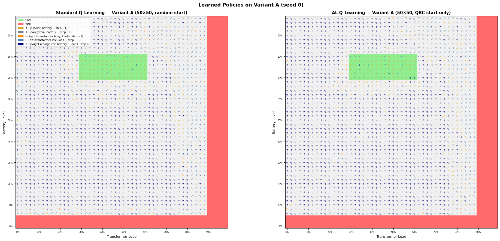

# Active Learning and Grid World

Applying an Active Learning (AL) strategy to Q-learning in a simulated energy grid management problem, evaluated on a 10×10 and a 50×50 grid.

## Problem Setting

The GridWorld simulates a battery storage and transformer load controller. Each state is a `(battery level, transformer load)` pair. Reaching the goal region (battery 70–80%, load 30–60%) yields a large positive reward; hitting a fault zone ends the episode with a large penalty.

The agent has five actions:

| Action | Meaning | Step reward |
|---|---|---|
| ↑ Up | EV charges via its own solar panel; battery level rises | −1 |
| ↓ Down | EV runs on battery with no charging; battery level falls | −1 |
| → Right | Transformer diverts to support other loads, ignoring the EV; transformer load rises | −1 |
| ← Left | Transformer sheds load; transformer load falls | −1 |
| ↗ Up-right | Transformer actively charges the EV; battery rises and load rises | 0 |

Up-right carries no step penalty because it is the productive charging action the system is designed for.

The image below shows learned policies on a 50×50 grid after training — left is the standard Q-learning baseline (random start), right is the AL agent (QBC start only). Arrows indicate the greedy action at each state; the green rectangle is the goal region and red areas are fault zones.



## Variants

The two notebooks vary in grid size.

### Variant A — QBC Start State Only

A committee of 5 independent Q-tables votes on the best action at every non-wall state. Each episode begins at the state where the committee disagrees most, measured by **vote entropy**. Action selection during exploration is uniform random for both the baseline and AL agent — the only AL difference is the episode start state.

| | Baseline | Active Learning (multi-agent) |
|---|---|---|
| **Episode start** | Uniformly random non-wall cell | State with max committee vote entropy |
| **Exploration action** | Uniform random | Uniform random (same as baseline) |

## Design Choices

### 1. Five actions: four cardinal directions (↑, ↓, →, ←) plus ↗ up-right

The first version of the environment only allowed diagonal movement (↗ up-right and ↙ down-left), similar to how a bishop moves in chess. This meant that only states lying on the same diagonal as the goal could ever reach it — agents starting outside that diagonal were permanently blocked from earning any positive reward, causing most episodes to end with large penalties. The fix was to add the four cardinal directions while keeping ↗ up-right (the productive transformer-charges-EV action), giving every state a path to the goal across all five actions.

### 2. Set ↗ up-right reward to 0 instead of a positive value

Intuitively ↗ up-right (transformer actively charges the EV) deserves a positive reward — it is the productive action the system is designed for. Setting it to, say, +10 causes the agent to circle indefinitely collecting step rewards instead of entering the goal. Two fixes are possible: decay the ↗ reward over time to motivate eventual goal-seeking, or simply set it to 0. This experiment uses 0 — it is semantically reasonable (the action is neutral cost, not penalised) and avoids introducing a decay hyperparameter that would require tuning.

### 3. Use 50×50 grids in addition to 10×10

On a 10×10 grid the exploration problem is easy enough that the random baseline can stumble onto a good route faster than AL converges. This makes AL look worse despite being a stronger strategy in harder settings. The 50×50 grid has 25× more states on the same episode budget, so the exploration advantage of AL is large enough to show up clearly in the results.

## Findings & Lessons Learned

### 1. Training reward diverges for AL Variant A yet evaluation still favours AL

Because the QBC start strategy deliberately places the agent in the states it is most uncertain about, the agent spends training in genuinely hard situations and accumulates lower per-episode rewards than the baseline. In evaluation (where both agents start from the same fixed states at the same environment snapshot), however, AL outperforms the baseline — a reminder that a dropping or noisy training curve does not always indicate a worse policy, especially when the training distribution is intentionally skewed toward difficulty.

## Files

| File | AL approach | Grid |
|---|---|---|
| `grid-world-AL-poc-variant-A-10x10.ipynb` | QBC start state | 10×10 |
| `grid-world-AL-poc-variant-A-50x50.ipynb` | QBC start state | 50×50 |

The 50×50 grid has 25× more states than the 10×10 grid but uses the same episode budget, making it a harder exploration problem.

## Setup

```bash
pip install -r requirements.txt
```

Open either notebook and run all cells.
